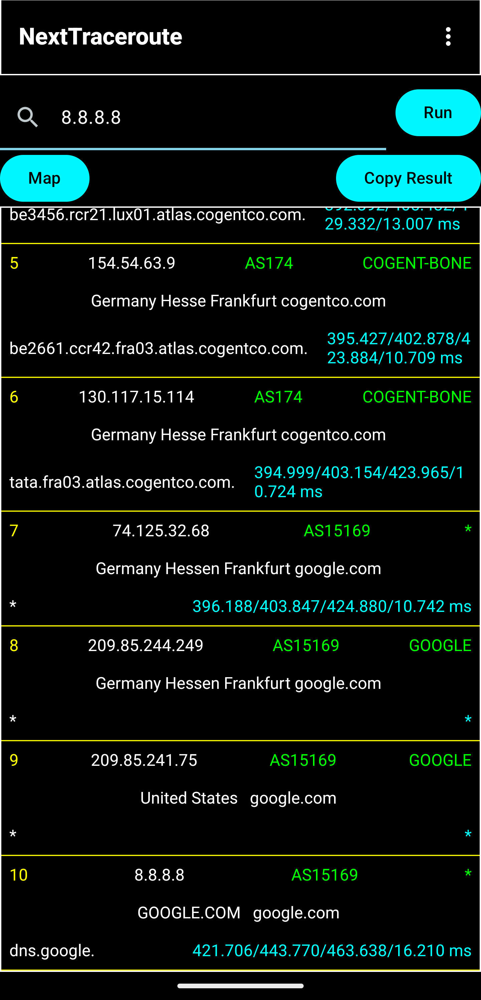
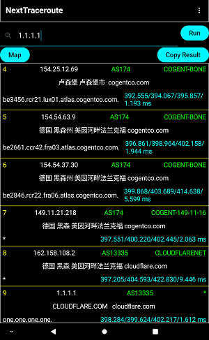
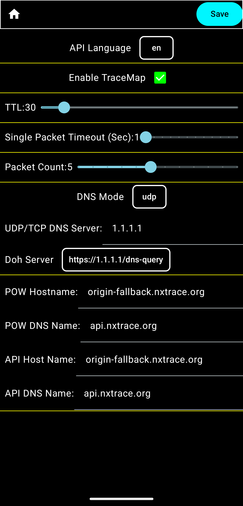

# NextTraceroute 

NextTraceroute is a root-free Android route tracing application that defaults to using the NextTrace API.

NextTraceroute，一款默认使用NextTrace API的免root安卓版路由跟踪应用。

# Usage

[Releases](https://github.com/nxtrace/NextTraceroute/releases)

Enter target address (IPv4, IPv6, Hostname and URL), press run, and enjoy!

支持IPv4、IPv6、域名输入和URL提取域名，点击运行。

# Get It on Google Play

<a href='https://play.google.com/store/apps/details?id=com.surfaceocean.nexttraceroute&pcampaignid=pcampaignidMKT-Other-global-all-co-prtnr-py-PartBadge-Mar2515-1'></a>

Thanks for the warmhearted support from every test user. This app has passed the closed testing, therefore it has entered the Google Play store. 

P.S. Users who have installed the test version can now uninstall it and download the official release from the link above.

感谢所有测试用户的热情支持，本应用已经通过封闭测试，正式进入Google Play商店。

P.S. 已经安装测试版的用户已经可以卸载测试应用，去上述链接下载正式版了。

# Contact

The following are all the social media and contact methods of the main maintainer of this project：

以下为本项目主要维护者的所有社交媒体及联系方式：

[r2qb8uc5@protonmail.com](mailto:r2qb8uc5@protonmail.com)

[Telegram channel](https://t.me/nexttraceroute)

# Example Screenshot




# FAQ

* Q: Why does the app return "IPv4 and IPv6 native ping failed! Using linux api instead. (Unstable)"?

  问：为什么程序返回“IPv4 and IPv6 native ping failed! Using linux api instead. (Unstable)”
  
  A: By default, user space Android programs are not allowed to use raw sockets. This program currently uses the ping and ping6 programs in the Linux system. This alert means that your Android device does not support the system's native ping and ping6 programs; therefore, this application cannot be used at this time. A root-free route tracing feature based on the Linux API is still under development.

  答：默认情况下，用户空间的安卓程序不允许使用原始套接字。本程序目前使用Linux系统自带的ping和ping6程序，这个警告表明您的安卓设备不支持系统原生的ping和ping6程序，因此目前无法使用该程序。基于Linux API的免root路由追踪功能仍在开发中。

* Q: Why do some anti malware programs report this application as a virus (e.g. Android:Evo-gen [Trj])?

  问：为什么有的杀毒软件报告本应用是病毒？（例如：Android:Evo-gen [Trj]）？
  
  A: This could be a false alarm by automatic scans. And we have reported this to related anti malware providers. Please ensure that your virus database is updated to the latest version. Only the binary software download methods mentioned on this GitHub page are officially released by the author. Please be cautious of this software from other sources.

  答：这可能是自动扫描的误报。我们已经向相关的反恶意软件提供商报告了这个问题，请确保您的病毒库更新到最新版本。只有此GitHub页面提到的二进制软件下载方法才是作者发布的，请小心其他来源的此软件。

# LICENSE
```
This program is free software: you can redistribute it and/or modify
it under the terms of the GNU General Public License as published by
the Free Software Foundation, either version 3 of the License, or
any later version.

This program is distributed in the hope that it will be useful,
but WITHOUT ANY WARRANTY; without even the implied warranty of
MERCHANTABILITY or FITNESS FOR A PARTICULAR PURPOSE.  See the
GNU General Public License for more details.

You should have received a copy of the GNU General Public License
along with this program [here](./LICENSE).  If not, see <https://www.gnu.org/licenses/>.

Disclaimer: The NextTrace API (hosted at nxtrace.org) used by default in this program is not managed by the program's developer.
We do not guarantee the performance, accuracy, or any other aspect of the NextTrace API,
nor do we endorse, approve, or guarantee the results returned by the NextTrace API.
Users may customize the API server address themselves.

This project uses the libraries listed below. Detailed information can be found in the LICENSE file of this project.

The "dnsjava" library is licensed under the BSD 3-Clause License.

The "seancfoley/IPAddress" library is licensed under the Apache 2.0 License.

The "square/okhttp" library is licensed under the Apache 2.0 License.

The "gson" library is licensed under the Apache 2.0 License.

The "slf4j-android" library is licensed under the MIT License.

The "androidx" library is licensed under the Apache 2.0 License.

```

[Privacy Policy](./PrivacyPolicy.md)
